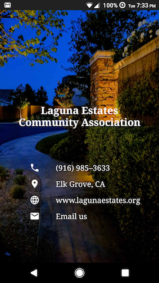

# CastelloPTA - Android Basics Nanodegree Project 1
## Purpose
- Design and implement single-screen app that displays information about a small business or organization
- Guidelines described in [Udacity Project 1 Rubric](/Project_1_Rubric.pdf)

## Features
- Layout variant for landscape mode
- Use of 4 different intent types for phone call, displaying location on map, opening website, sending email

## Screenshots
- Taken on Nexus 6 (API 27)

